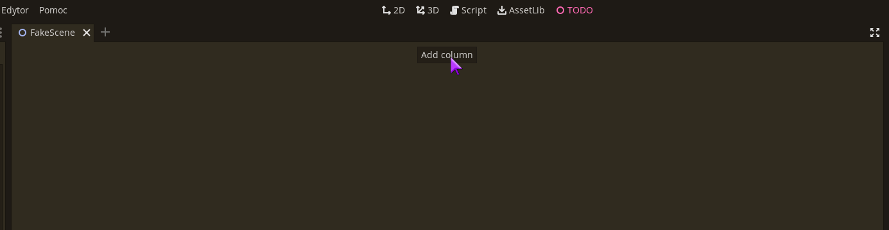
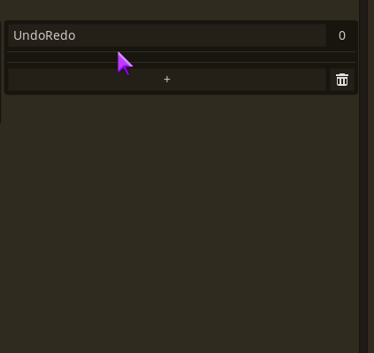
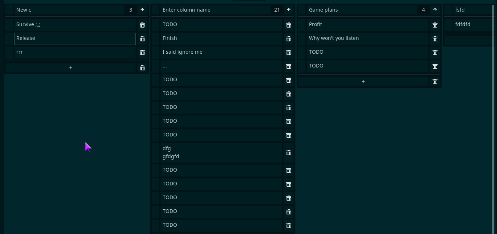
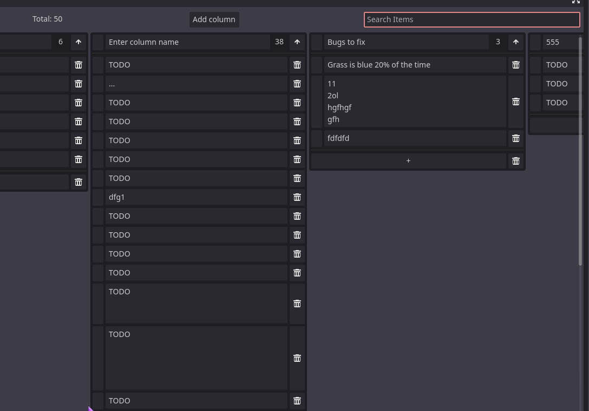
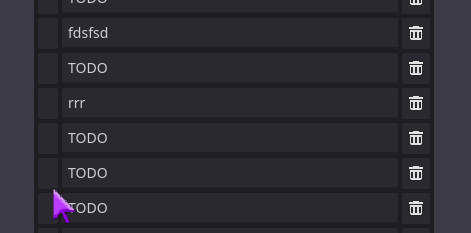
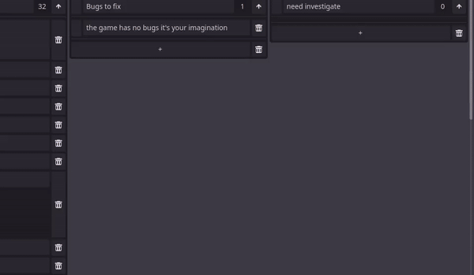

#  Godot Simple TODO

This simple plugin that lets you take random notes and organize them in named columns (which also count number of items). If you like putting your TODO lists in a text file, but they are hundreds of lines long and you start thinking that it's maybe too big, this plugin is for you. It's like kanban board, but without unnecessary features.

Just enable it to get a new editor screen called "TODO" where you can create columns, where you can create random labels where you can put any text. Simple as that.

The items can be added either using the `+` button or <kbd>Ctrl</kbd>+<kbd>Enter</kbd>.

The plugin has full undo support, up to 20 actions.

And drag and drop support (contributed by [@Nukiloco](https://github.com/Nukiloco)).

You can filter items.

There is also a simple "marker" function. You can middle-click the item's drag field to leave a temporary visual marker. The marker is not saved, it's only meant to easier keep track of the item you are currently working on.

## Images

You can also add images to your elements. Each element supports only one image. To add image, right-click item's drag field and select Paste Image:

Clicking an image will open a popup to preview it in full size.

Note that images are stored as a binary PNG data in their own file, which makes them less VCS-friendly. Also, while undo/redo works with images, their ID will shift, so it's not advised to undo/redo image changes.

## Data

Data of your columns is stored in a simple .cfg file. You can edit it by hand (the item names don't matter btw), but do so only when the plugin is not active. The plugin automatically saves all your changes. You can change the file where data is stored by modifying `DATA_FILE` constant in `SimpleTODO.gd`.

Images are stored separately in a .bin file (which is a serialized Dictionary), referenced as `IMAGE_DATA_FILE` constant. If an item has an image, it will be referenced by randomly generated unique ID. The plugin is able to automatically cleanup unused images, but it's better to not modify them manually, to avoid losing data.

___
You can find all my addons on my [profile page](https://github.com/KoBeWi).

